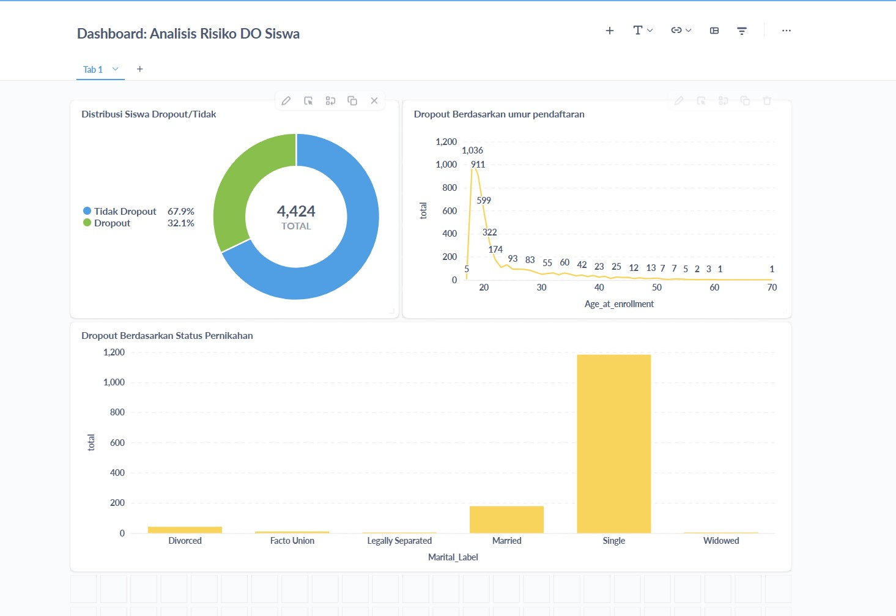

# Proyek Akhir: Menyelesaikan Permasalahan Perusahaan Edutech

## Business Understanding
Jaya Jaya Institut adalah institusi pendidikan yg telah berdiri sejak tahun 2000. Walaupun telah mencetak banyak lulusan, mereka menghadapi masalah serius berupa tingginya angka mahasiswa yg tidak menyelesaikan studinya (*dropout*). Tingginya angka dropout dapat merugikan reputasi, kualitas akademik, dan efisiensi operasional institusi.

### Permasalahan Bisnis

- Jumlah dropout siswa yg tinggi.
- Kesulitan mendeteksi siswa yg berpotensi dropout di awal perkuliahan.
- Ketiadaan alat visualisasi performa siswa untuk membantu monitoring data oleh pihak manajemen.

### Cakupan Proyek
- Melakukan analisis eksplorasi terhadap dataset siswa Jaya Jaya Institut.
- Melakukan seleksi fitur dan pemodelan machine learning untuk prediksi dropout.
- Mengembangkan prototipe aplikasi prediksi berbasis web menggunakan Streamlit.
- Menyusun dashboard interaktif untuk membantu tim manajemen memantau performa siswa.
- Menyusun rekomendasi tindakan berdasarkan temuan model dan dashboard.

### Persiapan

Sumber data: https://github.com/dicodingacademy/dicoding_dataset/blob/main/students_performance/data.csv

Setup environment:
```bash
pip install -r requirements.txt
```

## Business Dashboard
Dashboard dikembangkan menggunakan Metabase dan tersambung dengan database SQLite (dropout.db) yg berisi data hasil seleksi fitur (tanpa encoding dan scaling).

Dashboard menyajikan beberapa visualisasi penting:

- Distribusi dropout berdasarkan status pernikahan

- Nilai semester 1 & 2 dan hubungannya terhadap dropout

- Faktor demografis penting lainnya

Database: dropout.db
Metabase login: root@mail.com / root123
Screenshot: matcha-dashboard


Dashboard dapat dijalankan lokal dengan Docker container Metabase.

## Menjalankan Sistem Machine Learning
Sistem prediksi dibangun menggunakan model XGBoost hasil pelatihan dengan SMOTE balancing. Fitur penting dipilih dari proses eksplorasi dan pemodelan.

Aplikasi dibangun menggunakan Streamlit dengan UX yg ramah pengguna:

Label fitur sudah dimapping (contoh: status pernikahan, jenis kelamin)

Input pengguna mencakup data sosial, akademik, dan ekonomi

🔗 Link prototype online (Streamlit Community Cloud):
https://matcha-pds2.streamlit.app/

Atau dapat dijalankan local :

```bash
streamlit run app.py
```

## Conclusion
Model XGBoost berhasil mencapai akurasi 88% dengan F1-score 0.80 untuk kelas dropout. Prototipe yg dibangun mampu memberikan prediksi dropout secara langsung berdasarkan input siswa, dengan probabilitas yg informatif.

Dashboard yg dibangun juga membantu tim manajemen untuk:

- Memahami sebaran faktor dropout

- Mengamati performa akademik awal

- Menyusun intervensi dini berbasis data

### Rekomendasi Action Items
Berikan beberapa rekomendasi action items yg harus dilakukan perusahaan guna menyelesaikan permasalahan atau mencapai target mereka.
- Fokus pada siswa dengan nilai semester awal rendah untuk mendapatkan pembinaan akademik.
-Lakukan monitoring berkala menggunakan dashboard performa.

- Pertimbangkan dukungan tambahan untuk siswa dengan latar belakang sosial tertentu (e.g. usia muda atau kondisi ekonomi rentan).

- Terapkan sistem prediksi ini sebagai alat bantu seleksi dan pembinaan di awal semester